Image Links for HW5

5 pts Your Github account showing that is has been forked from the depaulcdm/springpetclinic
repository.

5 pts Your Travis CI dashboard showing a successful first build.

5 pts The section of the POM file showing the coordinates after you’ve changed them.
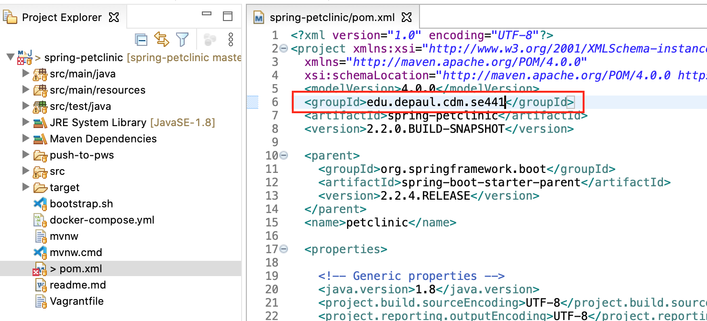

5 pts Your Travis CI dashboard showing a successful build after your change of the group
ID.
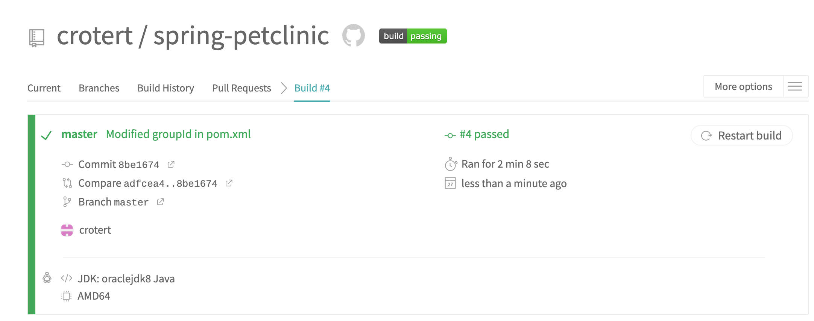

5 pts The section of the POM file showing the coordinates after you’ve commented them
out.
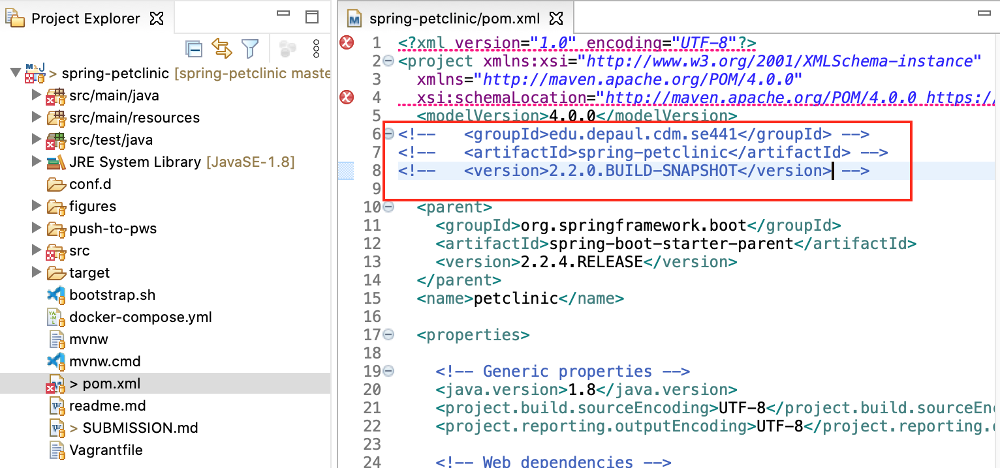

5 pts Your Travis CI dashboard showing the unsuccessful build after the breaking change.
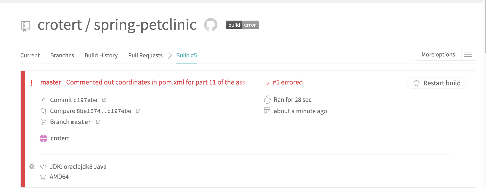

5 pts Your Github repository with the readme.md file selected showing the build failed
status after the Travis CI build fails.
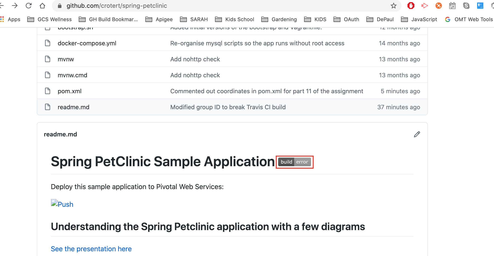

5 pts The section of the POM file showing the coordinates after you’ve fixed them.
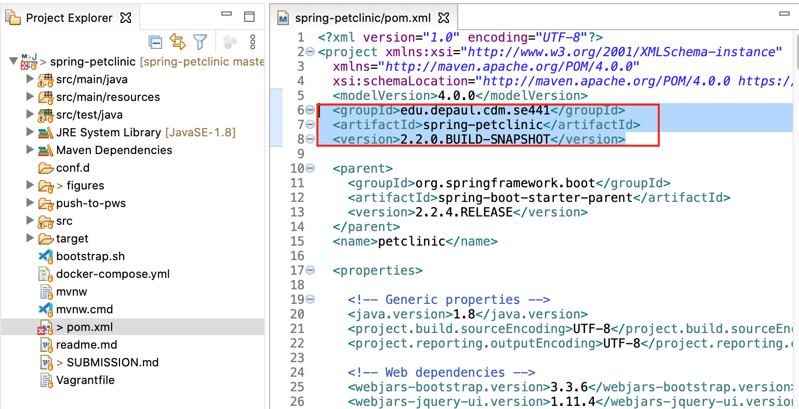

5 pts Your Travis CI dashboard showing the successful build after the breaking change has
been fixed.
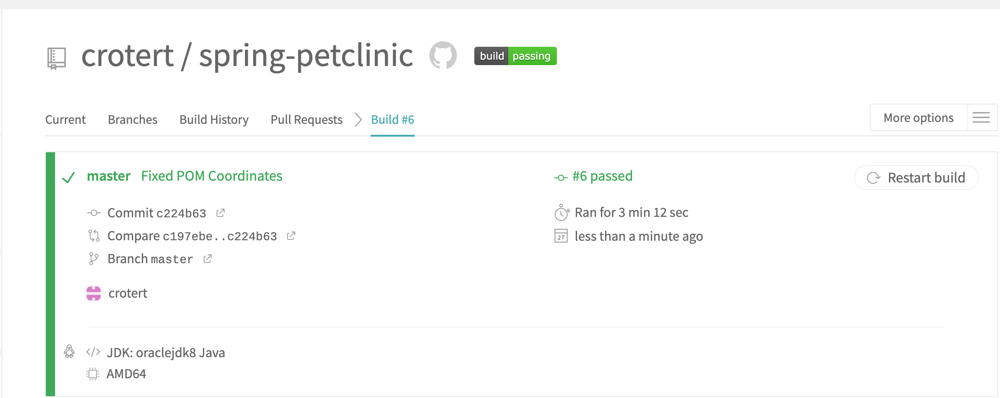

5 pts Your Github repository with the readme.md file selected showing the build success
status after the Travis CI build has recovered.
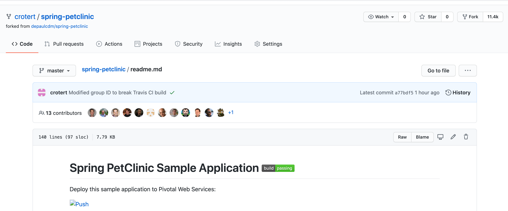

Image Links for HW7
VAGRANT
5 pts The output from the vagrant box list command after you execute the
vagrant box add command.
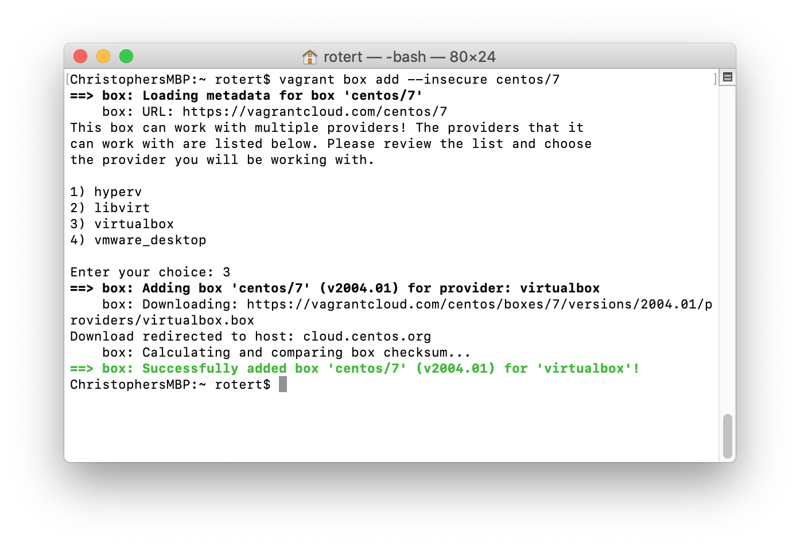

5 pts The output from the vagrant status command when your VM is not running.
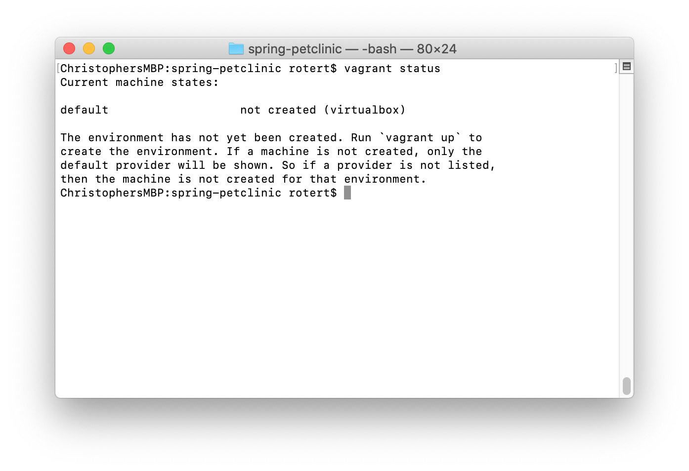

5 pts Your browser accessing the main page of the website from the Vagrant server while
the VM is not running at http://localhost:8484. Make sure your screen capture
shows the browser’s address bar.
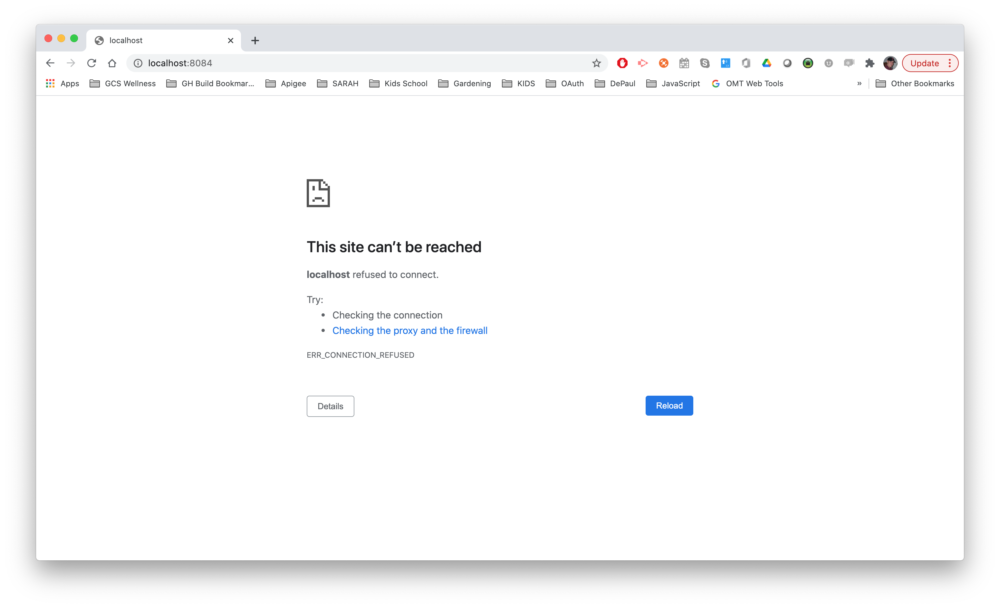

5 pts The output from the vagrant status command when your VM is running.

5 pts Your browser accessing the main page of the website from the Vagrant server when
your VM is running at http://localhost:8484. Make sure your screen capture
shows the browser’s address bar.
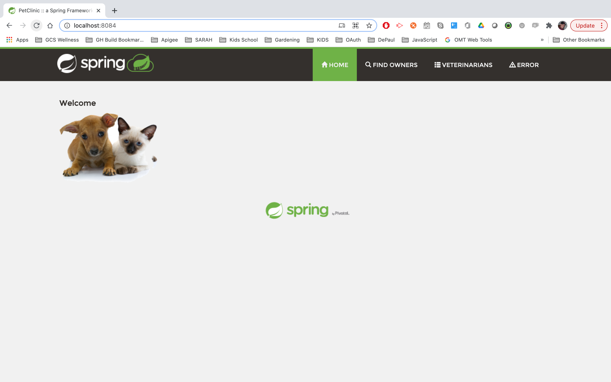

HEROKU
5 pts Your Heroku application list showing the Spring PetClinic application.
5 pts Your Heroku Spring PetClinic pipeline.
5 pts Your browser accessing the main page of the Spring PetClinic from Heroku. Make
sure your screen capture shows the browser’s address bar.
CHEF
5 pts The output of the generate cookbook command.
5 pts The directory structure for your cookbook.
5 pts The content of the first_cookbook.rb recipe.
5 pts The successful execution of the first_cookbook.rb recipe the first time. Show the
directory where the test.txt file will be created and the contents of that file after
running the chef recipe.
5 pts The successful execution of the first_cookbook.rb recipe after deleting the file.
Show the directory that used to contain the test.txt file and the contents of that
file after running the chef recipe.
5 pts The successful execution of the first_cookbook.rb recipe after changing the contents
of the test.txt file. Show the contents of test.txt file after your change and the
contents of that file after running the chef recipe.
5 pts The successful execution of the first_cookbook.rb recipe after changing the contents
of the recipe itself. Show the contents of first_cookbook.rb file after your change
and the contents of test.txt after running the chef recipe.
